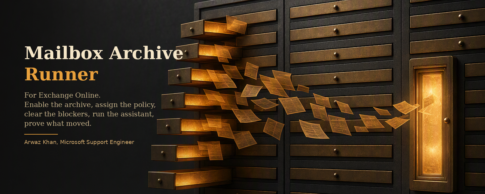
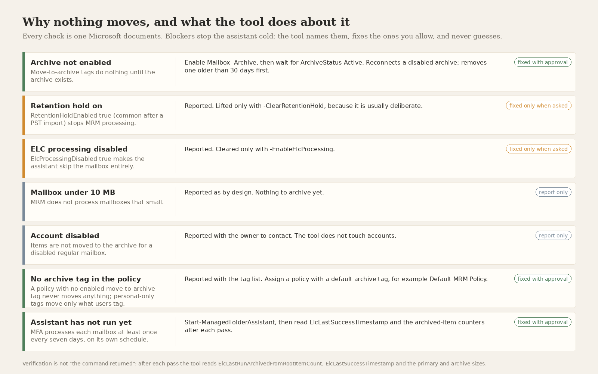
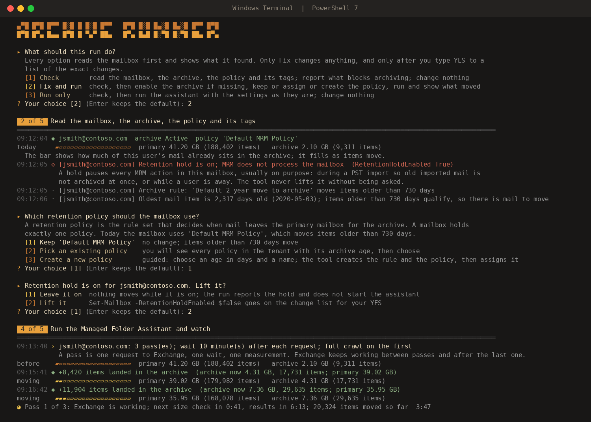

<p align="center">
  
</p>

<p align="center">
  <a href="#run-it"></a>
  <a href="#run-it"></a>
  <a href="docs/sources.md"></a>
  <a href="LICENSE"></a>
</p>

## The problem

You assign an archive policy, you tell the user their old mail will move, and then nothing happens. The Managed Folder Assistant runs on its own schedule, at least once every seven days, and it quietly skips mailboxes for reasons that never show up in the admin center: a retention hold left over from a PST import, a flag called ElcProcessingDisabled, a policy whose only archive tag is a personal one nobody applied, a mailbox that is still under 10 MB, an account that was disabled last week. Meanwhile the ticket says "archive not working".

The usual answer is to run `Start-ManagedFolderAssistant` and wait. That is not diagnosis, and it is not proof.

## What this does

One script, five stages. It connects, reads everything about the mailbox that Microsoft's own MRM troubleshooting article says to read, shows you the changes it wants to make, makes only the ones you approve, then runs the assistant in passes and reads Exchange's own counters after each one: `ElcLastSuccessTimestamp`, `ElcLastRunArchivedFromRootItemCount`, and the primary and archive sizes. A pass is called verified when items moved or the assistant completed a fresh run. Anything else is said plainly.

It also answers the question the ticket is really asking. Before it runs anything it reads the age of the oldest mail item and compares it with the archive age of the policy. If nothing is old enough to move yet, it says so, with the date the first item will qualify, instead of letting you watch a clean run that moves nothing.

<p align="center">
  
</p>

Nothing is deleted. The only changes it can make are the ones in that figure, each shown before, each checked after.

## Run it

Open PowerShell and paste one line. With no parameters it asks what to do (Check, Fix and run, Run only) and which mailbox, then reads the mailbox before asking anything else, so every later question is about what actually exists: keep the current policy, pick another from the tenant list with its archive age shown, or create one; how many passes and how long to wait; full crawl or not. Every question says what it is for and what each answer does. Enter keeps the suggested answer.

```powershell
irm https://raw.githubusercontent.com/bluespam-cyber/exchange-auto-archive/main/Invoke-MailboxArchive.ps1 -OutFile "$env:TEMP\Invoke-MailboxArchive.ps1"; & "$env:TEMP\Invoke-MailboxArchive.ps1"
```

Or clone the repo and use the launcher, which finds the script next to it (or downloads the current version when it is missing) and passes every argument through:

```powershell
git clone https://github.com/bluespam-cyber/exchange-auto-archive.git
cd exchange-auto-archive
.\Run-MailboxArchive.ps1
```

Or say everything on the command line:

```powershell
& "$env:TEMP\Invoke-MailboxArchive.ps1" -Mailbox user@contoso.com -RetentionPolicy "Default MRM Policy" -Passes 3 -IntervalMinutes 10
```

The ExchangeOnlineManagement module is installed for you if it is missing (you are asked first), and an open Exchange Online session is reused.

<details>
<summary><b>More ways to run it</b></summary>

```powershell
# Read only: what blocks archiving, how old the oldest mail is, when the first item qualifies. Changes nothing
.\Invoke-MailboxArchive.ps1 -Mailbox user@contoso.com -Mode Check

# Create a policy that archives after 90 days (if it does not exist yet), assign it, run with a full crawl
.\Invoke-MailboxArchive.ps1 -Mailbox user@contoso.com -RetentionPolicy "Archive after 90 days" -ArchiveAfterDays 90 -FullCrawl

# A mailbox that was migrated with the PST Import service: lift the retention hold, then push hard
.\Invoke-MailboxArchive.ps1 -Mailbox user@contoso.com -ClearRetentionHold -Passes 6 -IntervalMinutes 15

# Start the assistant and leave; read the result later with -Mode Check
.\Invoke-MailboxArchive.ps1 -Mailbox user@contoso.com -Mode Run -Passes 1 -IntervalMinutes 0

# Policy changed recently: recalculate tags across the whole mailbox on the first pass
.\Invoke-MailboxArchive.ps1 -Mailbox user@contoso.com -FullCrawl

# Enable auto-expanding archiving while you are there
.\Invoke-MailboxArchive.ps1 -Mailbox user@contoso.com -AutoExpandingArchive

# See what it would change and change nothing
.\Invoke-MailboxArchive.ps1 -Mailbox user@contoso.com -RetentionPolicy "Default MRM Policy" -WhatIf

# A list of users, unattended, with a case number in the report
Import-Csv .\users.csv | ForEach-Object { .\Invoke-MailboxArchive.ps1 -Mailbox $_.UPN -Passes 2 -Approve -NonInteractive -CaseNumber 1234567890 }
```

| Parameter | Meaning |
|---|---|
| `-Mailbox` | One or more identities (UPN, email, alias, GUID). Asked for when omitted in a console |
| `-Mode` | `Check` reads and reports, changes nothing, starts nothing. `Fix` (default) prepares with approval, then runs. `Run` changes no settings, only runs and measures |
| `-RetentionPolicy` | MRM policy to assign. Omit to keep the current one; `choose` shows the tenant list with each policy's archive age; `create` starts the guided creation; a name that does not exist yet is offered for creation |
| `-ArchiveAfterDays` | Age in days for the archive rule when the tool creates a policy (1 to 36500). Lets an unattended run create it |
| `-ArchiveTagOnly` | When creating a policy, do not carry over the personal and folder tags from the Default MRM Policy |
| `-Passes` | How many times this session asks Exchange to process the mailbox, 1 to 48. Default 3. Stops early when two passes in a row move nothing and completed cleanly |
| `-IntervalMinutes` | Minutes to wait after each request before measuring, 0 to 240. Default 10. During the wait the sizes are re-read about once a minute and every batch that lands in the archive is shown. 0 means start and leave |
| `-FullCrawl` | Recalculate tags across the whole mailbox on the first pass |
| `-ClearRetentionHold` | Lift `RetentionHoldEnabled` (with approval) |
| `-EnableElcProcessing` | Clear `ElcProcessingDisabled` (with approval) |
| `-AutoExpandingArchive` | Enable auto-expanding archiving (with approval, needs a qualifying licence, cannot be undone) |
| `-Approve` | Pre-approve the change set for unattended runs. Without it an unattended run changes nothing |
| `-OutputRoot`, `-CaseNumber`, `-NonInteractive`, `-Quiet`, `-NoOpenReport`, `-WhatIf` | The usual |

</details>

## Passes and the interval, explained

The Managed Folder Assistant is the Exchange process that applies the policy: it stamps every item with its tag and moves the ones past the archive age. Exchange runs it on its own at least once every 7 days. That schedule is Microsoft-managed; nobody can change it, and this tool does not pretend to.

What the tool controls is how many times this session asks Exchange to process the mailbox right now, and how long it waits after each request before measuring.

- **A pass** is one request (`Start-ManagedFolderAssistant`), one wait, one measurement.
- **The interval** is the wait. Exchange works asynchronously; the request returns at once and the move happens in the background, so the tool waits, then reads `ElcLastSuccessTimestamp`, the moved-item counters and both mailbox sizes.
- A normal mailbox is processed within minutes of one request. A large mailbox (tens of GB) is throttled and moves in slices, which is what extra passes are for. Two passes in a row that complete cleanly and move nothing end the run early.
- Presets in the menu: once with a 10-minute wait; 3 passes 10 minutes apart (about 30 minutes, the default); 6 passes 15 minutes apart (about 90 minutes); 12 passes 30 minutes apart (about 6 hours); start and leave (one request, no wait, read the result later with `-Mode Check`); or custom.

## What a run looks like

<p align="center">
  
</p>

Five stages with amber tabs. As soon as the mailbox is read you see both sizes and a meter of how much of the mail already sits in the archive. Every finding carries a grey line saying why it matters. While the assistant works, a glow shows a countdown to the next size check and to the results, and each batch that lands in the archive is printed the moment it is seen, with the meter filling. The summary ends with "What this means" in plain words: archiving works and this many items moved; or the setup is right but nothing is old enough yet, and when the first item qualifies; or exactly which blocker stopped it. In the classic console, in scheduled output, or with `NO_COLOR` set, it prints plain lines instead.

## What it checks before it touches anything

Archive status and a disabled archive left behind; the assigned MRM policy and every tag in it, with the retention action and age of the default archive tag; the age of the oldest mail item against that archive age; `RetentionHoldEnabled` and its end date; `ElcProcessingDisabled`; litigation hold; whether the account is disabled; the 10 MB floor; auto-expanding archive; and the ELC counters from the last time the assistant ran. Every finding names the Microsoft article it comes from and says in one line why it matters.

## Creating a policy

When the mailbox has no policy, or its policy has no move-to-archive rule, or you simply want a shorter age than the 2 years in the Default MRM Policy, the tool creates one for you: you choose the age in days and a name, it shows the exact `New-RetentionPolicyTag` and `New-RetentionPolicy` commands, and creates them after your YES. The new policy gets one default move-to-archive tag with your age, plus the personal and folder tags carried over from the Default MRM Policy so users keep their Outlook menu (`-ArchiveTagOnly` skips that). An existing tag with the same settings is reused rather than duplicated. Creating tags needs the Retention Management role; assigning them needs Mail Recipients.

## Exit codes

| Code | Meaning |
|---|---|
| 0 | Done and verified |
| 1 | A blocker remains or a change was not approved |
| 2 | A change could not be verified |
| 3 | Stopped early; the report is still written |

## Files

```
Invoke-MailboxArchive.ps1   the tool
Run-MailboxArchive.ps1      launcher: finds the tool next to it or downloads the current version
docs/how-it-works.md        stages, blockers, verification, decision rules
docs/sources.md             the Microsoft articles behind every check
docs/troubleshooting.md     when the tool itself cannot proceed
assets/                     banner and figures
```

## Requirements

Windows PowerShell 5.1 or PowerShell 7. ExchangeOnlineManagement 3.x (installed on request). An account with the Mail Recipients role in Exchange Online (Recipient Management or Organization Management has it); creating a policy also needs Retention Management (Organization Management, Compliance Management or Records Management). The mailbox needs an archive entitlement: Exchange Online Plan 2, an E3 or E5 plan, or the Exchange Online Archiving add-on.

## Author

Arwaz Khan, Microsoft Support Engineer.

Third of a set built the same way: read first, one Microsoft source per claim, nothing deleted, everything verified. See also [SPO UID](https://github.com/bluespam-cyber/spo-user-id-mismatch) and [M365 Sign-In Repair](https://github.com/bluespam-cyber/m365-signin-repair).
